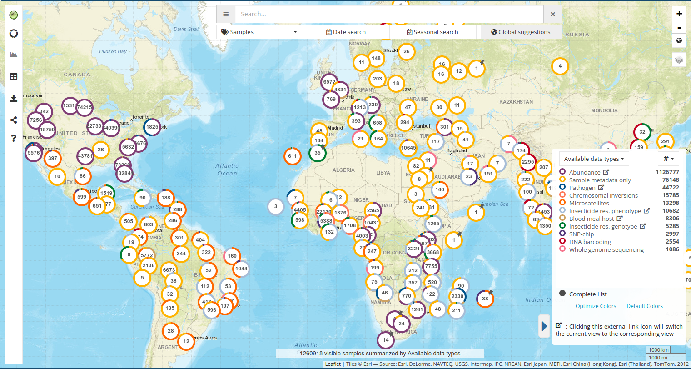
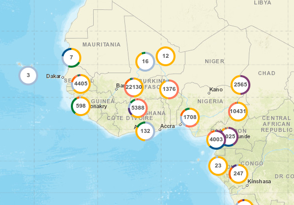
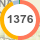
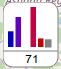
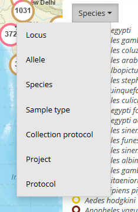
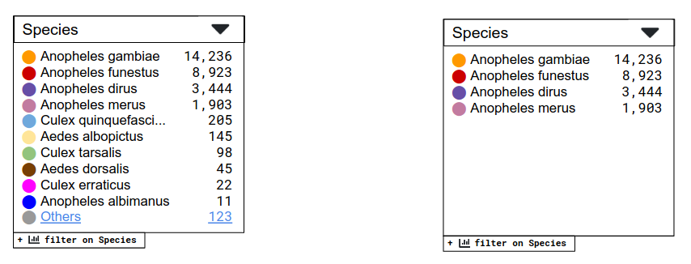
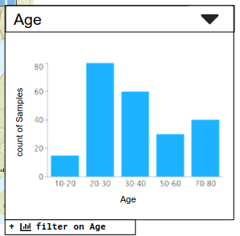
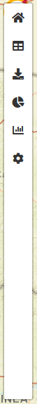
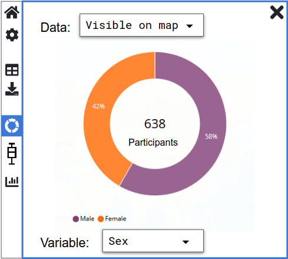

# List of likely MapVEu components

## The map itself



The screenshot shows the whole application but what concerns us here is the zoomable/pannable map only.

It is this component that is likely to handle user-drawn polygons for
selection.  Once a polygon is drawn, does it become a child component
(like a Marker)?  Polygon drawing should likely be a configurable feature though.

### Props

```
  viewport: Viewport,  // { center : LatLong, zoom : number }

  markers: ReactElement<MarkerProps>[]

  nudge? : 'geohash' | 'none',   // would { method : 'geohash', other_props: ... } be better?
  grid? : { type: 'geohash', level: number },

  height : CSSProperties['height'],
  width : CSSProperties['width'],

  onViewportChanged : (bvp: BoundsViewport) => void,

  // future things
  layers? : ???, // layer data or URLs

  // polygon drawing callbacks?
  onDrawnPolygon? : ???

```

### Children

All the components below are likely to be children of the map
component, because things like the zoom controls, legend, search box
and the chart drawer will need to be handled by Leaflet plugins (I think).


## Markers layer



Displays markers of different component types.

### Props

```
  markers : ReactElement<MarkerProps>[],
  nudge? : 'geohash' | 'none'

  onViewportChanged : (bvp: BoundsViewport) => void,
```


## Classic Donut Marker



This would be a simple donut/pie marker.  In VB the total count of the
categories would be displayed in the middle.  Though there is an issue
with the pie chart being generated for multi-valued fields (the sum of
the counts is more than the sum of the records, so ideally a separate
value should be provided (see value prop below).

Double clicking a marker should auto-zoom to the `extent` of the marker.
Not sure if that requires a function prop?

### Props

```
  key : string, // usually the geohash string that was used to aggregate the data under this marker
  position : LatLong, // [ number, number ]
  data : {
    value : number,
    label : string, // see legend.data[].label; not displayed but good to have the data available for an enlarged version
    color : string  // hex rgb
  }[],
  isAtomic : boolean, // show thumbtack marker if zooming in won't disaggregate
  onMouseOut :  (e: LeafletMouseEvent) => void,
  onMouseOver :  (e: LeafletMouseEvent) => void,

  // future things
  extent? : polygon/GeoJSON, // in MV1.0 this would be the bounding box of the points aggregated into the
                             // marker, which is shown as a grey rectangle upon mouseover
			     // in MV2.0 it could be a rectangle, or perhaps a more complex polygon
			     // (e.g. convex hull, or a polygon representing the data point, e.g.
			     // a health center catchement area (clinepi UMSP dataset) - but for
			     // non-atomic markers, we would have to merge/union polygons.
  onSelected : () => {},
  onDeselected : () => {}
```


## Mini Histogram Marker



Non-categorical fields (numeric or date) will probably have to have
tiny histogram markers.  That's because it doesn't make much sense to
visualise distributions of numeric or date variables in a circle (why
should 1970 be next to 2020?).

Should be NO MORE THAN ABOUT 5 BINS in my opinion.  For interpretability
the bins should be the same for all markers.

6th bin can be for 'no data'

Colours? Not sure individual colours per bin are needed.  Or a gradient?

### Props

(same as donut marker except addition of optional yAxisRange (though we probably won't use it))

```
  key : string, // usually the geohash string that was used to aggregate the data under this marker
  position : LatLong, // [ number, number ]
  data : {
    value : number,
    label : string, // see legend.data[].label; not displayed but good to have the data available for an enlarged version
    color : string  // hex rgb
  }[],
  yAxisRange? : [ number, number ], // if absent, do automatic range (local scaling)
  isAtomic : boolean, // show thumbtack marker if zooming in won't disaggregate
  onMouseOut :  (e: LeafletMouseEvent) => void,
  onMouseOver :  (e: LeafletMouseEvent) => void,

  // future things
  extent? : polygon/GeoJSON, // in MV1.0 this would be the bounding box of the points aggregated into the
                             // marker, which is shown as a grey rectangle upon mouseover
			     // in MV2.0 it could be a rectangle, or perhaps a more complex polygon
			     // (e.g. convex hull, or a polygon representing the data point, e.g.
			     // a health center catchement area (clinepi UMSP dataset) - but for
			     // non-atomic markers, we would have to merge/union polygons.
  onSelected : () => {},
  onDeselected : () => {}
```


## Legend field/variable select menu



This will be a shared component with EDA.


## Legend

At the moment do not try to implement a select menu for changing the
variable. This will likely be a separate component (see previous
component above).

For categorical variables (first example with "overflow")



For numeric and date variables (bars will likely be colored with a gradient (see histogram markers above), unlike in the screenshot below)



### Behaviour

There needs to be a button/link to open up the filter (see the thing
hanging off the bottom).

Clicking on the "Others..." row should also open up the filter.

The onShowFilter handler will take care of that.

#### Categorical

It will only display the top 10 (sorting reverse numeric order on
'values') categories. If there are more than 10 it will show the
Others link (and total).  Clicking anywhere on the Others line will
open the "full filter" for this variable.  (The component will have to calculate the Others total.)

Clicking on items in the legend will NOT add a filter for that category.
We may decide that **any** click will open up the actual filter (which
can handle multiple selections).

#### Numeric/date

There will never be more than 5 bins (plus an optional 6th bin for "no data" counts).

The values will be counts or some other aggregate statistic returned from the back end.

I'm not sure if legendType needs to differentiate between numeric and date, but it might
be necessary for formatting the bin labels differently for dates?

Note the string values for labels for the histogram (in the props
below). If using a **plot-component** to render this, we should
probably use the bar chart (not the histogram) because it expects
string labels (histogram expects numeric x-coords).

There shouldn't be any gaps between the bars.


### Props

```typescript
  legendType : 'categorical' | 'numeric' | 'date',
  data : {
    label : string, // categorical e.g. "Anopheles gambiae"
                    // numeric e.g. "10-20"
    value : number,
    color : string
  }[],
  variableLabel : string, // e.g. Species or Age
  quantityLabel : string, // ** comment below

  onShowFilter : () => {},  // callback to open up filter panel
  onShowVariableChooser : () => {}, // callback to open up variable selector

```


** MapVEu 1.0 Sample View shows counts of records in the
   legend/filter, but Abundance View shows an aggregate statistic
   based on sample_size_i and the unique number of values for another
   field.  So we will want to provide this and display it in the
   legend. In numeric/date legends it is obviously located next to the
   y-axis.  In categorical legends, I'm not sure where it could go (tidily).
   


## Sidebar

This is the left hand sidebar/drawer that we had in the old map.

It is a container for Tabs (see below)

It will typically be deployed as a sibling to the MapVEuMap element.
Size and positioning CSS will be handled by the application, but
default style (for demoing in Storybook) should either be provided by
the Sidebar component or in the story.



### Props

```typescript
  closeIcon : string, // e.g. 'fas fa-times'

  isCollapsed : boolean,
  tabSelected? : string, // id of selected tab

  onOpen : (tabId : string) => {},
  onClose : () => {},

  tabGroups: string[], // each tabGroup has an id (e.g. 'top') - ids can be used for styling
  showSeparators: boolean, // show separators between tab groups

  tabs : ReactElement<TabProps>[] // or maybe as children, see below

```


## Sidebar Tab

Need to think about do we need enabled/disabled (e.g. greyed out) functionality (like in MV1.0),
or should the tabs simply disappear if they are not relevant for the current active entity (from the ER diagram).

### Props
```
  name: string,  // e.g. 'Home'
  tabIcon: string, // see Sidebar.closeIcon
  tabGroup: string, // e.g. 'top' or 'middle'
  isActive: boolean, // true => normal, false => grayed out
  
  onSelected : () => {},   // Do we need handlers like this?
  onDeselected : () => {}, // When a tab is active/selected it may need a trigger to fetch data for plotting?

  content: ReactElement<SidebarTabContentProps>[]  // or just have nested children?

```


## Sidebar Tab Content example

### Sidebar Donut Chart



Note that we might not have this type of plot in the final MapVEu2.0
(because we might prefer to have enlarged donut/histogram markers on
mouse-over in the actual map) but it would be the easiest plot type to
implement to get something working in the sidebar.

#### Props

The following is very preliminary
```
  dataSource : 'selectedMarkers'
  dataSourceOptions : 'selectedMarkers' | 'visible' | 'allFiltered' | 'unfiltered' // These are the options that would be available in a select menu.
                                                                            // They control how much data the chart will show.
									    // All Chart tabs would have this select menu, so perhaps
									    // there needs to be a SidebarChart 'super'-component


  stratificationVariable : VariableSpec           // the current variable used for stratification
  stratificationVariableOptions : VariableSpec[]  // the options the user can select in the dropdown

  // no 'data' prop here - let the SidebarDonutChart component fetch it!

```

## Putting all the sidebar stuff together...

```jsx
  <Sidebar closeIcon="fas fa-times" isCollapsed={true} onOpen=? onClose=?
           tabGroups={['top', 'middle']},
	   showSeparators={true}>
    <SidebarTab name="Home" tabIcon="fas fa-home" tabGroup="top"
                onSelected=? onDeselected=?>
      <div>
	My Home content.
      </div>
    </SidebarTab>
    <SidebarTab name="Donut Chart" tabIcon="fas fa-donut" tabGroup="middle" isActive={true}
                onSelected=? onDeselected=?>
      <SidebarDonutChart dataSource="visible"/>
    </SidebarTab>
  </Sidebar>
```

However, note that (as briefly mentioned in the Sidebar Tab section
above) the tabs are likely to be dynamically added/removed depending
on which entity we are dealing with, so we're not likely to hardcode
them like I have done here...?

Question: how do we wire things such that clicking on the "Donut
Chart" SidebarTab would signal to the SidebarDonutChart component that
it needed to do a data request?


