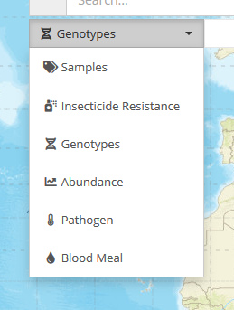

# List of likely MapVEu components

## The map itself

The screenshot shows the whole application but what concerns us here is the zoomable/pannable map only.

It is this component that is likely to handle user-drawn polygons for
selection.  Once a polygon is drawn, does it become a child component
(like a Marker)?  Polygon drawing should likely be a configurable feature though.

### Props

* center (lat,long)
* zoom level (Leaflet zoom, integer)
* data
  * markers
  * layers? (raster and vector layer data)

* onMapUpdate : `({ bounds, zoomLevel }) => void` 
* onDrawnPolygon : `( { id, geometry }) => void`  (communicate newly drawn polygon to outside world)

### Children

All the components below are likely to be children of the map
component, because things like the zoom controls, legend, search box
and the chart drawer will need to be handled by Leaflet plugins (I think).

## Markers layer

Displays markers of different component types.

### Props

* data (from data.markers, see map component above)

* onMapUpdate (see map component above)

## Classic Donut Marker

This would be a simple donut/pie marker.  In VB the total count of the
categories would be displayed in the middle.  Though there is an issue
with the pie chart being generated for multi-valued fields (the sum of
the counts is more than the sum of the records, so ideally a separate
value should be provided (see value prop below).

Double clicking a marker should auto-zoom to the `extent` of the marker.
Not sure if that requires a function prop?

### Props

* id : string (if aggregating on geohash strings, this should be the geohash string)
* position : LatLong
* extent : Geometry (bbox or other geometry (e.g. convex hull) to show geographic extent of data aggregated "under" the marker)
* selected : Boolean
* values : number[] (these are the amounts represented in the mini-donut chart, e.g. the counts per species)
* labels : string[] (these are the labels, e.g. species names, that won't normally be displayed due to space limits, but might be if you mouse-over a marker to expand it)
* colors : colorSpec[]  (array of colours, or mapping from label to colour?)
* value : string | number (value to be shown in the center of the donut)

* onSelected : `({id, extent}) => void`
* onDeselected : `({id, extent}) => void`

## Mini Histogram Marker

(no screenshot or mock-up yet)

Non-categorical fields (numeric or date) will probably have to have
tiny histogram markers.  That's because it doesn't make much sense to
visualise distributions of numeric or date variables in a circle (why
should 1970 be next to 2020?).

Should be NO MORE THAN ABOUT 5 BINS in my opinion.  For interpretability
the bins should be the same for all markers.

Colours? Not sure individual colours per bin are needed.  Or a gradient?

### Props

* id : string (if aggregating on geohash strings, this should be the geohash string)
* position : LatLong
* extent : Geometry (bbox or other geometry (e.g. convex hull) to show geographic extent of data aggregated "under" the marker)
* selected : Boolean
* values : number[] (these are the amounts represented by bar height, e.g. the counts per year bin)
* labels : string[] (string labels, e.g. 1982-1994, 1995-2003, possibly for click/mouseover enlarged version)

* onSelected : `({id, extent}) => void`
* onDeselected : `({id, extent}) => void`

## View select menu

Allows the user to switch between "views".  Each view shows one type
of record (or a back-end hardcoded subset of a type of record) and
there may be different fields available in different views.  The idea
is that some fields are the same between views (e.g. species).

### Props

* availableViews : id[]  (list of view IDs)
* labels : string[]      (labels to show)
* defaultView : id       (default view ID)
* onViewChange: (viewId : id) => void

## Filter field select menu

Allows user to choose a which field to filter on in the legend panel.

Note that when the view changes, the availableFields must change too.
If the currently selected field exists in both fromView and toView on
view change, then it should remain selected, otherwise fall back to
defaultField.

Will this be limited to showing a relatively small number of fields (<15) ?
(as in MapVEu 1.0)

Or will it be scalable to 100s of fields using hierarchical nesting and OWL-file config?

### Props

* availableFields : id[]  (list of field IDs)
* labels : string[]       (labels to show)
* defaultField : id       (default field ID)
* onFieldChange : (fieldId : id) => void

## Filter/legend

The legend in MapVEu 1.0 went through several iterations.  It started
being simply a legend panel to show the colour scheme for the
currently active filter field.  Colours are always going to be tricky
because you users can distinguish max 20 (and that's pushing it). Grey
shades are used for the remainder.  The "default colors" in MapVEu 1.0
are not simply assigned to the 20 most populous categories. There is
an algorithm to distribute the colours across the globe (and there was
a separate AJAX request to get the data for this, e.g. smplPalette,
abndPalette etc), which prevented Africa having all the colours
(because most data was there).  Nowadays the USA would hog all the
colours because the largest numbers of samples are there (e.g. Aedes
vexans sensu lato).  Then we added the "Optimize Colors" functionality
and this assigned the 20 colours to the 20 most populous categories in
the markers currently on screen (in the current viewport and
satisfying all active filters).  The numbers on the right hand side of
the legend were a similarly recent addition, as were the sorting
options.

The legend has always been a filter, by which we mean that when you
click on a category name, it adds a filter for that category.
(Ctrl-click adds a NOT filter.)  Adding multiple filters from the
legend wasn't really possible, unless you went to the "Complete list"
which was not 100% intuitive and also a bit buggy.

Therefore in MapVEu 2.0 we can completely revisit the legend/filter panel.
Here are some things we can consider in 2.0:

1. Simplify the colour palette behaviour. Maybe have the map always
   colour the 20 most populous categories in the currently visible data.
   Allow the user to freeze the current colour palette when they need to.

2. Build multi-select in from the start.  This may require an extra click
   (e.g. "Apply" and "Cancel" buttons that appear, like in site search),
   but that should be fairly intuitive for users.

3. The footprint must be small by default, but often the filter will
   need to display many categories (or wide numeric and date ranges,
   see next point) - so it should have a "compact mode" where it acts
   like a legend - providing critical colour palette info for the most
   populous categories (or date distributions), and an "extended mode"
   where it's possible to see all categories (by paging/scrolling or
   whatever) and to see numeric variable and date distributions in
   full. Maybe the filter functionality should only be available in
   extended mode?
   
4. It will handle numeric and date variables, not just categorical
   text variables (as present, e.g. species, collection protocol, ...).
   In MapVEu 1.0 the date variable had special filter UI elements below
   the search box.  But this would break if a dataset had more than one
   date (e.g enrollment date, clinic visit date), so date should be
   treated just like any other variable.  This means the legend/filter
   needs to handle non-categorical fields.

### Props

* data:
  - xType: 'categorical' | 'numeric' | 'date'   (very close to Datum type: string|number|Date)
  - x: Datum[]
  - y: number[]
  - colors: colorSpec[]   (definitely needed for categorical data)
  - xLabel: string        (this is basically the field name, e.g. species)
  - yLabel: string        (e.g. 'count' or 'total specimens'**)
* mode: 'compact' | 'extended'
* onZoomed  (callback after zooming - might need new data (semantic zoom))
* onSelected (callback that communicates selection either discrete x values and/or a range x1-x2)

But how about multiple data series (e.g. grey and red histograms of WDK filters)?

** MapVEu 1.0 Sample View shows counts of records in the legend/filter, but Abundance View
   shows the sum of the sample_size_i field for all filter fields (e.g. species, collection method etc)

