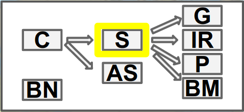
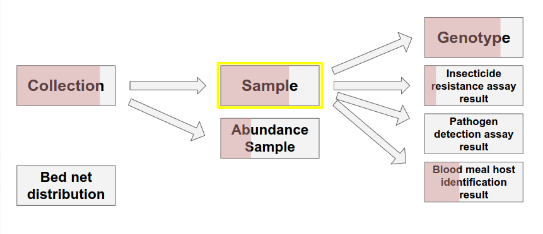
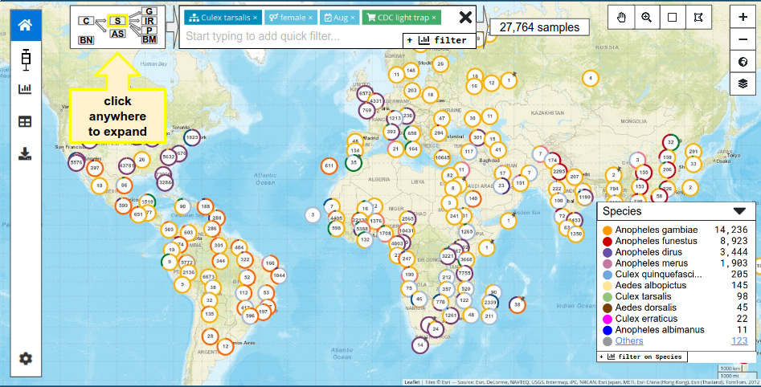

## Entity diagram

'Entities' refer to organisational units in the data.  E.g. mosquito
popbio data can be thought of as Collections of Samples that have one
or more Assays etc.  Collections, Samples and Assays are the entities.
In MV1.0 the view selector chose predefined entity-based slices
through the data.  In EDA and MV2.0 we want to show the user how the
different entities relate - in particular where the has_many
relationships are.

We can expect to have to deal with no more than around 10 entities.

We need two versions of the diagram - minimised and maximised.

#### Entity relationship data.

This is attached to the [redmine ticket](https://redmine.apidb.org/issues/42929).

It may be necessary to create some other tree data manually (to test other tree topologies).

NOTE: the mock-ups include multiple, unconnected root entities
(e.g. Collection and Bed net distribution), however the demo data does
not (and can not) handle multiple roots. So, assume single rooted
trees for now please.


### Mini version

This is the smallest possible representation that shows the entities
unambiguously via abbreviations of their names.  For now we will
generate the abbreviations in the component, but they may end up being
provided from the service.

The only 'functionality' the mini version has will be

1. highlighting of the current 'active' entity
2. clicking anywhere will open up the expanded version




### Expanded version

This version will show the full entity names, be clickable to select a new entity, and show some quantitative data (the pink/grey shading).

Note: the data for the pink/grey shading will come at a later date (and it will be independent of the main `data` prop, see below).  We can use random values for now.





### Props

```
  data : StudyData;  // is there a typescript def for this already?
  isExpanded : boolean;
  highlightedEntityId : string; // e.g. 'GEMS_HouseObs'

  // TO DO:
  // click handlers for mini and expanded
  // 
```

### Context within app

This component will be shown somewhere near the top of the map, see the screenshot below




