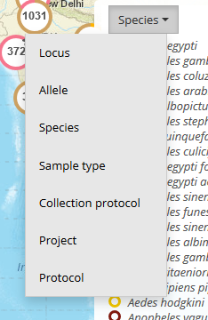
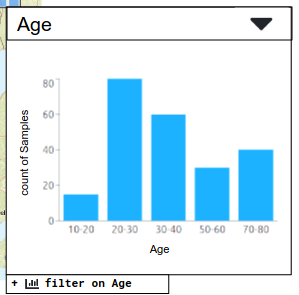

## Legend field/variable select menu



This will be a shared component with EDA.


## Legend

At the moment do not try to implement a select menu for changing the
variable. This will likely be a separate component (see previous
component above).

For categorical variables (first example with "overflow")


For numeric and date variables (bars will likely be colored with a gradient (see histogram markers above), unlike in the screenshot below)



### Behaviour

There needs to be a button/link to open up the filter (see the thing
hanging off the bottom).

Clicking on the "Others..." row should also open up the filter.

The onShowFilter handler will take care of that.

#### Categorical

It will only display the top 10 (sorting reverse numeric order on
'values') categories. If there are more than 10 it will show the
Others link (and total).  Clicking anywhere on the Others line will
open the "full filter" for this variable.  (The component will have to calculate the Others total.)

Clicking on items in the legend will NOT add a filter for that category.
We may decide that **any** click will open up the actual filter (which
can handle multiple selections).

#### Numeric/date

There will never be more than 5 bins (plus an optional 6th bin for "no data" counts).

The values will be counts or some other aggregate statistic returned from the back end.

I'm not sure if legendType needs to differentiate between numeric and date, but it might
be necessary for formatting the bin labels differently for dates?

Note the string values for labels for the histogram (in the props
below). If using a **plot-component** to render this, we should
probably use the bar chart (not the histogram) because it expects
string labels (histogram expects numeric x-coords).

There shouldn't be any gaps between the bars.


### Props

```typescript
  legendType : 'categorical' | 'numeric' | 'date',
  data : {
    label : string, // categorical e.g. "Anopheles gambiae"
                    // numeric e.g. "10-20"
    value : number,
    color : string
  }[],
  variableLabel : string, // e.g. Species or Age
  quantityLabel : string, // ** comment below

  onShowFilter : () => {},  // callback to open up filter panel
  onShowVariableChooser : () => {}, // callback to open up variable selector

```


** MapVEu 1.0 Sample View shows counts of records in the
   legend/filter, but Abundance View shows an aggregate statistic
   based on sample_size_i and the unique number of values for another
   field.  So we will want to provide this and display it in the
   legend. In numeric/date legends it is obviously located next to the
   y-axis.  In categorical legends, I'm not sure where it could go (tidily).
   

