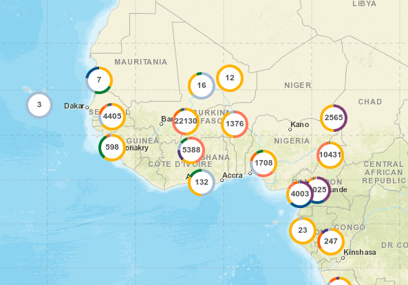
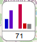

## The map itself


The screenshot shows the whole application but what concerns us here is the zoomable/pannable map only.

It is this component that is likely to handle user-drawn polygons for
selection.  Once a polygon is drawn, does it become a child component
(like a Marker)?  Polygon drawing should likely be a configurable feature though.

### Props

```
  viewport: Viewport,  // { center : LatLong, zoom : number }

  markers: ReactElement<MarkerProps>[]

  nudge? : 'geohash' | 'none',   // would { method : 'geohash', other_props: ... } be better?
  grid? : { type: 'geohash', level: number },

  height : CSSProperties['height'],
  width : CSSProperties['width'],

  onViewportChanged : (bvp: BoundsViewport) => void,

  // future things
  layers? : ???, // layer data or URLs

  // polygon drawing callbacks?
  onDrawnPolygon? : ???

```

### Children

All the components below are likely to be children of the map
component, because things like the zoom controls, legend, search box
and the chart drawer will need to be handled by Leaflet plugins (I think).


## Markers layer



Displays markers of different component types.

### Props

```
  markers : ReactElement<MarkerProps>[],
  nudge? : 'geohash' | 'none'

  onViewportChanged : (bvp: BoundsViewport) => void,
```


## Classic Donut Marker


This would be a simple donut/pie marker.  In VB the total count of the
categories would be displayed in the middle.  Though there is an issue
with the pie chart being generated for multi-valued fields (the sum of
the counts is more than the sum of the records, so ideally a separate
value should be provided (see value prop below).

Double clicking a marker should auto-zoom to the `extent` of the marker.
Not sure if that requires a function prop?

### Props

```
  key : string, // usually the geohash string that was used to aggregate the data under this marker
  position : LatLong, // [ number, number ]
  data : {
    value : number,
    label : string, // see legend.data[].label; not displayed but good to have the data available for an enlarged version
    color : string  // hex rgb
  }[],
  isAtomic : boolean, // show thumbtack marker if zooming in won't disaggregate
  onMouseOut :  (e: LeafletMouseEvent) => void,
  onMouseOver :  (e: LeafletMouseEvent) => void,

  // future things
  extent? : polygon/GeoJSON, // in MV1.0 this would be the bounding box of the points aggregated into the
                             // marker, which is shown as a grey rectangle upon mouseover
			     // in MV2.0 it could be a rectangle, or perhaps a more complex polygon
			     // (e.g. convex hull, or a polygon representing the data point, e.g.
			     // a health center catchement area (clinepi UMSP dataset) - but for
			     // non-atomic markers, we would have to merge/union polygons.
  onSelected : () => {},
  onDeselected : () => {}
```


## Mini Histogram Marker



Non-categorical fields (numeric or date) will probably have to have
tiny histogram markers.  That's because it doesn't make much sense to
visualise distributions of numeric or date variables in a circle (why
should 1970 be next to 2020?).

Should be NO MORE THAN ABOUT 5 BINS in my opinion.  For interpretability
the bins should be the same for all markers.

6th bin can be for 'no data'

Colours? Not sure individual colours per bin are needed.  Or a gradient?

### Props

(same as donut marker except addition of optional yAxisRange (though we probably won't use it))

```
  key : string, // usually the geohash string that was used to aggregate the data under this marker
  position : LatLong, // [ number, number ]
  data : {
    value : number,
    label : string, // see legend.data[].label; not displayed but good to have the data available for an enlarged version
    color : string  // hex rgb
  }[],
  yAxisRange? : [ number, number ], // if absent, do automatic range (local scaling)
  isAtomic : boolean, // show thumbtack marker if zooming in won't disaggregate
  onMouseOut :  (e: LeafletMouseEvent) => void,
  onMouseOver :  (e: LeafletMouseEvent) => void,

  // future things
  extent? : polygon/GeoJSON, // in MV1.0 this would be the bounding box of the points aggregated into the
                             // marker, which is shown as a grey rectangle upon mouseover
			     // in MV2.0 it could be a rectangle, or perhaps a more complex polygon
			     // (e.g. convex hull, or a polygon representing the data point, e.g.
			     // a health center catchement area (clinepi UMSP dataset) - but for
			     // non-atomic markers, we would have to merge/union polygons.
  onSelected : () => {},
  onDeselected : () => {}
```

