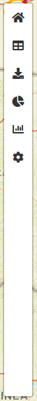
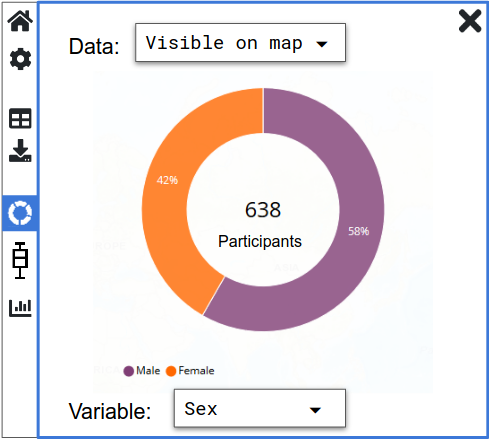

## Sidebar

This is the left hand sidebar/drawer that we had in the old map.

It is a container for Tabs (see below)

It will typically be deployed as a sibling to the MapVEuMap element.
Size and positioning CSS will be handled by the application, but
default style (for demoing in Storybook) should either be provided by
the Sidebar component or in the story.



### Props

```typescript
  closeIcon : string, // e.g. 'fas fa-times'

  isCollapsed : boolean,
  tabSelected? : string, // id of selected tab

  onOpen : (tabId : string) => {},
  onClose : () => {},

  tabGroups: string[], // each tabGroup has an id (e.g. 'top') - ids can be used for styling
  showSeparators: boolean, // show separators between tab groups

  tabs : ReactElement<TabProps>[] // or maybe as children, see below

```


## Sidebar Tab

Need to think about do we need enabled/disabled (e.g. greyed out) functionality (like in MV1.0),
or should the tabs simply disappear if they are not relevant for the current active entity (from the ER diagram).

### Props
```
  name: string,  // e.g. 'Home'
  tabIcon: string, // see Sidebar.closeIcon
  tabGroup: string, // e.g. 'top' or 'middle'
  isActive: boolean, // true => normal, false => grayed out
  
  onSelected : () => {},   // Do we need handlers like this?
  onDeselected : () => {}, // When a tab is active/selected it may need a trigger to fetch data for plotting?

  content: ReactElement<SidebarTabContentProps>[]  // or just have nested children?

```


## Sidebar Tab Content example

### Sidebar Donut Chart



Note that we might not have this type of plot in the final MapVEu2.0
(because we might prefer to have enlarged donut/histogram markers on
mouse-over in the actual map) but it would be the easiest plot type to
implement to get something working in the sidebar.

#### Props

The following is very preliminary
```
  dataSource : 'selectedMarkers'
  dataSourceOptions : 'selectedMarkers' | 'visible' | 'allFiltered' | 'unfiltered' // These are the options that would be available in a select menu.
                                                                            // They control how much data the chart will show.
									    // All Chart tabs would have this select menu, so perhaps
									    // there needs to be a SidebarChart 'super'-component


  stratificationVariable : VariableSpec           // the current variable used for stratification
  stratificationVariableOptions : VariableSpec[]  // the options the user can select in the dropdown

  // no 'data' prop here - let the SidebarDonutChart component fetch it!

```

## Putting all the sidebar stuff together...

```jsx
  <Sidebar closeIcon="fas fa-times" isCollapsed={true} onOpen=? onClose=?
           tabGroups={['top', 'middle']},
	   showSeparators={true}>
    <SidebarTab name="Home" tabIcon="fas fa-home" tabGroup="top"
                onSelected=? onDeselected=?>
      <div>
	My Home content.
      </div>
    </SidebarTab>
    <SidebarTab name="Donut Chart" tabIcon="fas fa-donut" tabGroup="middle" isActive={true}
                onSelected=? onDeselected=?>
      <SidebarDonutChart dataSource="visible"/>
    </SidebarTab>
  </Sidebar>
```

However, note that (as briefly mentioned in the Sidebar Tab section
above) the tabs are likely to be dynamically added/removed depending
on which entity we are dealing with, so we're not likely to hardcode
them like I have done here...?

Question: how do we wire things such that clicking on the "Donut
Chart" SidebarTab would signal to the SidebarDonutChart component that
it needed to do a data request?


